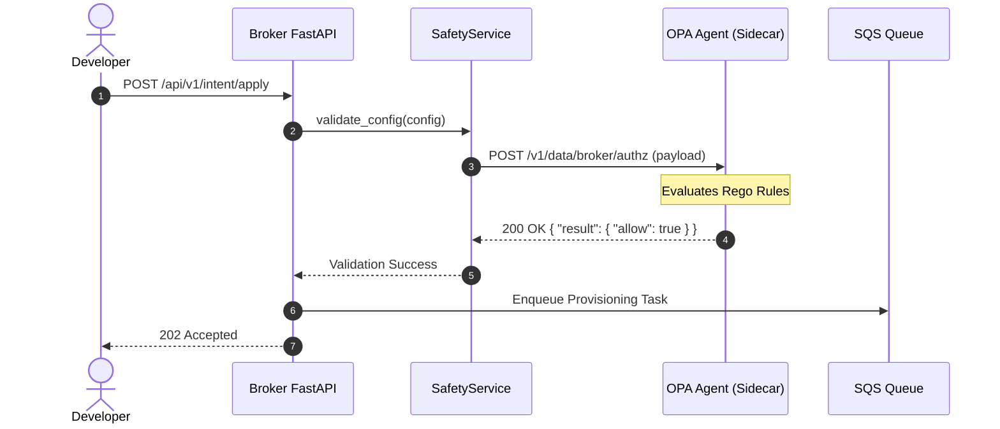

# Centralized Policy Engine (OPA/Rego) Integration Blueprint

This document details the architectural blueprint for transitioning validation rules out of static Python files (`test_safety.py`) into a centralized, production-grade policy engine powered by **Open Policy Agent (OPA)** using **Rego**.

---

## Why Centralized Policies?

As the list of cloud services, security policies, and environment constraints grows:
- **Static files become unmaintainable**: Hardcoded logic requires full deployment cycles to update rules.
- **Decoupled Compliance**: Security teams should define limits (e.g. blast radius scores, restricted namespaces) without editing python application code.
- **Auditability**: Policies can be version-controlled, run as test suites, and audited independently.

---

## Target Architecture

The following diagram illustrates how the `SafetyService` delegates policy enforcement to an OPA Sidecar before any resource is enqueued or applied.



---

## 1. Example Rego Policy (`policy.rego`)

This policy enforces critical constraints such as requiring the `target_cluster` parameter, bounding the `blast_radius` risk score, and limiting production changes.

```rego
package broker.authz

# By default, deny all requests
default allow = false
default reason = "unauthorized config change"

# Whitelisted actions
allowed_actions := {"create_route", "update_rate_limit", "delete_route"}

# Main authorization rule
allow {
    not has_validation_errors
}

# Collect all validation errors
has_validation_errors {
    count(errors) > 0
}

# Rule 1: Action must be whitelisted
errors["action_not_allowed"] {
    not allowed_actions[input.action]
}

# Rule 2: Ensure 'target_cluster' is present when configuring routes
errors["missing_target_cluster"] {
    input.action == "create_route"
    not input.parameters.target_cluster
}

# Rule 3: Enforce maximum blast radius score for non-forced changes
errors["blast_radius_exceeded"] {
    not input.force
    input.blast_radius.risk_score > 0.60
}

# Rule 4: Prevent deletions in production environment unless forced
errors["prevent_prod_delete"] {
    input.action == "delete_route"
    input.context.environment == "production"
    not input.force
}

# Output format details for the client
errors_list = e {
    e := [msg | errors[msg]]
}
```

---

## 2. Python OPA Client Adapter (`opa_adapter.py`)

A clean wrapper class to query the OPA agent over HTTP.

```python
import httpx
from typing import Any, Dict, List

class OPAValidationError(Exception):
    """Raised when OPA rejects a configuration."""
    def __init__(self, errors: List[str]):
        self.errors = errors
        super().__init__(f"OPA policy validation failed: {', '.join(errors)}")

class OPAClient:
    """HTTP client adapter to query local OPA policies."""
    
    def __init__(self, opa_url: str = "http://localhost:8181"):
        self.opa_url = opa_url.rstrip("/")
        
    async def validate_config(
        self, 
        config: Dict[str, Any], 
        context: Dict[str, Any], 
        force: bool = False
    ) -> Dict[str, Any]:
        """Query OPA for authorization to apply the config.
        
        Args:
            config: The parsed configuration payload
            context: Environment metadata (e.g. production/staging)
            force: Force bypass flag
            
        Returns:
            Dict containing validation status and errors.
        """
        payload = {
            "input": {
                "action": config.get("action"),
                "parameters": config.get("parameters", {}),
                "blast_radius": config.get("blast_radius", {}),
                "context": context,
                "force": force
            }
        }
        
        async with httpx.AsyncClient() as client:
            try:
                response = await client.post(
                    f"{self.opa_url}/v1/data/broker/authz",
                    json=payload,
                    timeout=2.0
                )
                response.raise_for_status()
                data = response.json()
            except httpx.HTTPError as e:
                # Fallback policy (e.g., Fail Closed for security)
                return {
                    "is_valid": False,
                    "errors": [f"Failed to reach Policy Engine: {str(e)}"]
                }
                
        result = data.get("result", {})
        is_allowed = result.get("allow", False)
        errors = result.get("errors_list", [])
        
        if not is_allowed and not errors:
            errors = ["Denied by policy engine (reason unspecified)"]
            
        return {
            "is_valid": is_allowed,
            "errors": errors
        }
```
