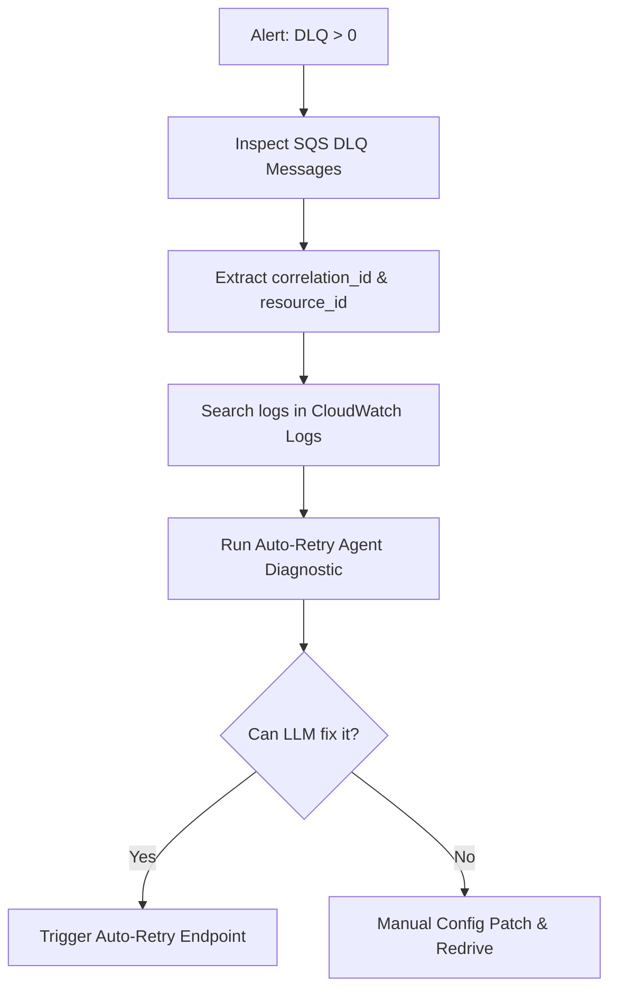

# Operations Runbook: DLQ Alerting, Triage, and Recovery

This runbook describes the operational procedures for triaging, debugging, and resolving dead letter queue (DLQ) task backlogs for the Advanced AI Service Broker.

---

## 1. Alerting Overview

An alert is triggered in AWS CloudWatch / EventBus under the following conditions:
* **Metric**: `ApproximateNumberOfMessagesVisible` on `broker-tasks-dlq` > 0.
* **Severity**: High (P2).
* **Impact**: Message processing has failed repeatedly (3+ retries) and the task has been quarantined.

---

## 2. Step-by-Step Triage Flow



### Step 2.1: Locate the Quarantined Messages
1. Open the AWS Console and navigate to **SQS**.
2. Select the queue `broker-tasks-dlq`.
3. Click **Send and receive messages**, then click **Poll for messages**.
4. Inspect the message body to extract:
   * `task_id`
   * `resource_id`
   * `correlation_id` (used for tracing logs)

### Step 2.2: Query Centralized CloudWatch Logs
1. Navigate to **CloudWatch Logs Insights**.
2. Select the log group for your ECS Services (`/aws/ecs/osb-api-production` and `/aws/ecs/osb-worker-production`).
3. Run the following query to trace the request lifecycle:
   ```sql
   fields @timestamp, @message, level, correlation_id, resource_id
   | filter correlation_id = "YOUR_CORRELATION_ID"
   | sort @timestamp desc
   ```
4. Identify the specific exception (e.g., OPA validation failure, connection timeout to Sovereign, syntax drift).

---

## 3. Diagnostic & Auto-Recovery Procedures

### Strategy A: AI-Powered Auto-Retry (Staged Self-Healing)
If the failure is due to config discrepancies, edge sync drift, or syntax errors, use the **Auto-Retry Agent**:

1. Trigger the recovery endpoint:
   ```bash
   curl -X POST "https://api.broker.production.internal/api/v1/resources/{resource_id}/auto-retry" \
     -H "Authorization: Bearer YOUR_ADMIN_API_KEY"
   ```
2. The `AutoRetryAgent`:
   * Pulls the error logs matching the correlation ID.
   * Prompts the LLM Gateway to generate a corrected blueprint configuration.
   * Runs compliance checks via the OPA engine.
   * Re-enqueues the corrected task to `broker-tasks`.
3. Verify that the resource's `sync_status` transitions back to `IN_SYNC`.

### Strategy B: Manual Redrive (Dead-Letter Queue Redrive)
If the issue was a transient down-time of Sovereign (Control Plane) and the service is now healthy:
1. Navigate to **SQS** -> `broker-tasks-dlq`.
2. Click **Start DLQ Redrive**.
3. Select **Redrive to source queue** (`broker-tasks`).
4. Click **Redrive**.

---

## 4. Cost Monitoring & AWS Budgets
To prevent unexpected cost spikes due to anomalous LLM usage or database scale-ups:
* **Budget Setup**: Configure AWS Budgets to alert when monthly forecasted spending on Bedrock/OpenAI or DynamoDB exceeds 120% of baseline.
* **Rate Limits**: Ensure rate limits are active in OPA policies to block massive parallel provisioning requests.

---

## 5. Threat Modeling & Staging Validation
Before pushing any runtime modifications to production:
1. Run the Chaos Test suite in staging to verify that Failsafe policies reject bad traffic:
   ```powershell
   python scripts/chaos_test.py
   ```
2. Run the full regression test suite:
   ```powershell
   python -m pytest tests/test_red_team.py
   ```
